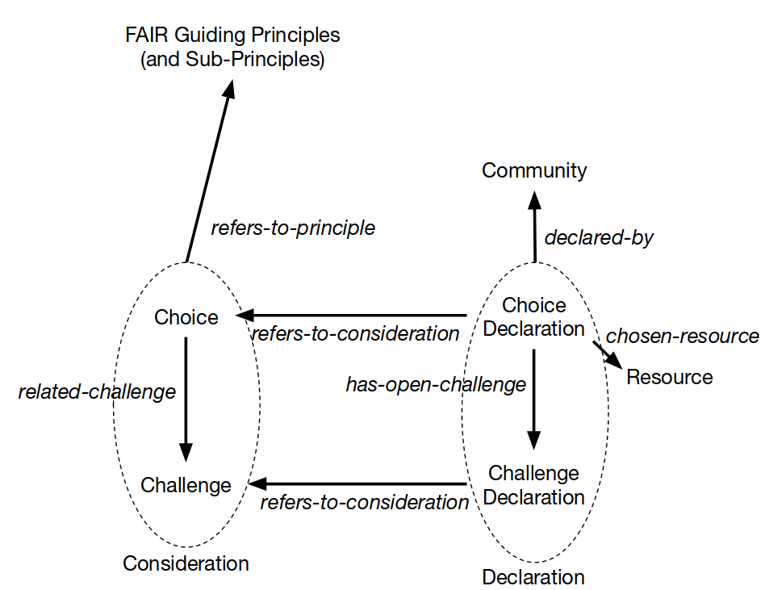

# Overview of the FAIR Implementation Choices and Challenges Model (Draft)

## Diagram

## Namespace

    https://w3id.org/fair/icc/terms/

## Classes

- `Choice`: The kind of choice communities have to make (can be expressed as a question; choices are represented as rows in the Matrix)
- `Community`: A non-empty set of people and/or organizations that form a self-declared community with the aim to implement the FAIR principles for their fields of interest (communities are represented as columns in the Matrix)
- `ChoiceDeclaration`: The expression of a community of their choice made (corresponds to an answer to a question, i.e. a cell in the Matrix)
- `Resource`: An artifact or service that can contribute to the implementation of the FAIR principles (corresponds to the possible values of the cells in the Matrix)

## Properties (= Relations)

- `refers-to-principle`: connects a `Choice` (left) to the FAIR principle (right) it refers to (a choice can refer to zero or more FAIR principles)
- `refers-to-choice`: connects a `ChoiceDeclaration` (left) to the `Choice` (right) it is derived from (indicates row of the Matrix; a choice declaration has to refer to exactly one choice; to address several choices, separate choice declarations should be defined)
- `declared-by`: connects a `ChoiceDeclaration` (left) to the `Community` (right) that made the declaration (a choice declaration has to refer to exactly one community; to refer to several communities, separate choice declarations should be defined)
- `chosen-resource`: connects `ChoiceDeclaration` (left) to the `Resource` that was chosen through the declaration (to refer to several resources, separate choice declarations should be defined)

## TODO

Include `Challenge` and `ChallengeDeclaration`...
